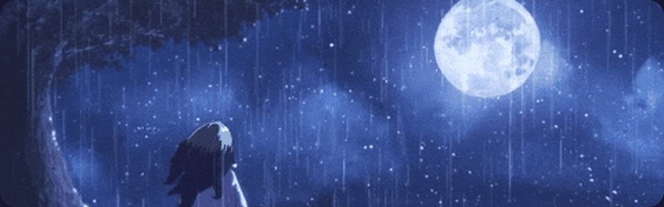
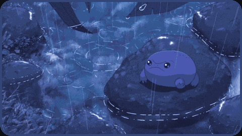
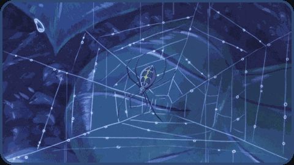
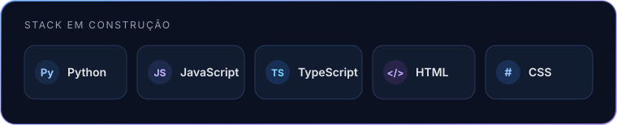
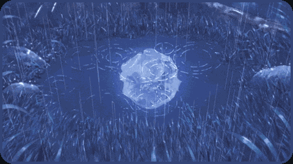

  

<h1 align="center">Gustavo Assunção</h1>

  <strong>Engenharia de Software · Desenvolvimento Web · Dados</strong>

  Curioso por sistemas, experiências digitais e pela forma como a tecnologia organiza o cotidiano.

  
  

---

### um pouco sobre mim

> **21 anos** · Engenharia de Software na **UNDB** · São Luís, MA

Sou estudante de Engenharia de Software e gosto de aprender investigando como as coisas funcionam. Tenho interesse por **desenvolvimento web, organização de dados e processos** — caminhos que já exploro em projetos acadêmicos e práticos, de interfaces e simuladores ao tratamento de dados com Python.

Tenho um olhar naturalmente organizado e visual: gosto de testar, ajustar e deixar cada entrega clara, útil e agradável de usar.

`desenvolvimento web` · `dados` · `automação` · `design` · `aprendizado contínuo`

🎧 Música, histórias e jogos também fazem parte do jeito como observo, penso e crio.

 

### tecnologias que fazem parte do caminho

 

<h3 align="center">─────── 💙 ouvindo agora ───────</h3>

  
  

### criando um pouco a cada dia

<picture>
  <source media="(prefers-color-scheme: dark)" srcset="https://raw.githubusercontent.com/gustavoassun/gustavoassun/output/snake-dark.svg" />
  <source media="(prefers-color-scheme: light)" srcset="https://raw.githubusercontent.com/gustavoassun/gustavoassun/output/snake-light.svg" />
  
</picture>

  projetos chegando aos poucos — com calma, intenção e personalidade. ✦

